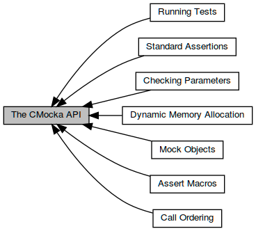

## cmocka介绍

## cmocka

[TOC]


### 1 cmocker简介

官网：https://cmocka.org/

CMocka 是一款支持 mock 对象、面向C语言的单元测试框架，CMocka 往往是编译成库的形式，供C单元测试程序链接调用。其前身是谷歌开发的 Cmockery，由于后者缺少维护，因此 CMocka 继承了 Cmockery 并继续维护。

CMocka 框架的**特性**：
- 支持模拟对象，可设置模拟函数的期望返回值，期望输出参数，可检查模拟函数的输入参数、函数调用顺序。
- 支持Test fixtures（包括setup和teardown）.
- 不依赖第三方库，只需要一个C库即可.
- 支持众多平台（Linux, BSD, Solaris, Windows和嵌入式平台）和编译器（GCC, LLVM, MSVC, MinGW等）.
- 提供对异常信号(SIGSEGV, SIGILL, …)的处理。
- 非fork()执行.
- 提供基本的内存检测，包括内存泄露，内存溢出检测.
- 提供丰富的断言宏.
- 支持多种格式输出 (STDOUT, SUBUNIT, TAP, XML).
- 开源.


### 2 CMocka编译安装
CMocka 往往是以库的形式提供给测试程序链接调用的，为此我们需要先将 CMocka 源码编译成库。

从官网下载 CMocka 源码：
`git clone git://git.cryptomilk.org/projects/cmocka.git`

编译、安装步骤在源码中的 README.md 和 INSTALL.md 文件中有详细说明，我的版本是 cmocka-1.1.5，在linxu系统下编译安装步骤为：

```
cd cmocka
mkdir build && cd build
cmake ..
make
make install
```


### 3 编写CMocka测试程序
有了 CMocka 库，就可以开始使用 CMocka 框架编写单元测试程序了。


#### 3.1 通常用法
源码 `cmocka/example/simple_test.c` 很好的展示了 CMocka 的通常用法，代码如下所示：

```
#include <stdarg.h>
#include <stddef.h>
#include <setjmp.h>
#include <stdint.h>
#include <cmocka.h>

/* A test case that does nothing and succeeds. */
static void null_test_success(void **state) {
    (void) state; /* unused */
}

int main(void) {
    const struct CMUnitTest tests[] = {
        cmocka_unit_test(null_test_success),
    };
    return cmocka_run_group_tests(tests, NULL, NULL);
}
```

其中 `null_test_success` 函数是测试用例，`CMUnitTest` 结构体是测试用例集（可以包含多个测试用例），每个测试用例可以设定可选的 `startup` 和 `teardown` 函数，用于负责执行测试前的初始化和测试后的销毁工作。上面示例中使用了 `cmocka_unit_test` 宏来填充 `CMUnitTest` 结构体中的测试用例（ `startup` 和 `teardown` 为 `NULL`）。`cmocka_run_group_tests` 函数用于启动测试并展示测试结果，可以为测试集指定全局的 `startup` 和 `teardown`（示例中都是`NULL`）。

编译很简单:
```
# cd cmocka/example
# gcc -o simple_test simple_test.c -lcmocka
```

其中 -lcmocka 会链接前面安装的 /usr/local/lib/libcmocka.so 库。执行测试程序看看效果：

```
# ./simple_test 
[==========] Running 1 test(s).
[ RUN      ] null_test_success
[       OK ] null_test_success
[==========] 1 test(s) run.
[  PASSED  ] 1 test(s).
```

#### 3.2 头文件
在 #include <cmocka.h> 之前，必须先 #include 以下四个头文件，这是官网 [The CMocka API](https://api.cmocka.org/group__cmocka.html) 中明确要求的，在 cmocka.h 头文件开头部分也有注明。


#### 3.3 测试函数
CMocka 的测试用例是一个C函数，其函数签名为：
`void test_func(void **state)`

其中 `void **state` 指针是指向 `CMUnitTest` 结构体中的 `void *initial_state` 变量的地址，在初始化 `CMUnitTest` 结构体时会设置 `initial_state` 变量初始值（如 `cmocka_unit_test` 宏会设置 `initial_state` 为 `NULL`，还有其他初始化的宏，会在后续中介绍），`state` 指针也会传递给测试用例对应的 `setup` 和 `teardown` 函数。

```
int setup(void **state)
int teardown(void **state)
```

执行测试用例的过程中，会**按先后顺序依次调用** `setup`、`test_func` 和 `teardown` 三个函数，它们都可以访问（读或写） `CMUnitTest` 结构体中的 `initial_state` 变量。

源码 `cmocka/tests/test_basics.c` 中的示例很好的演示了 state 指针的使用，代码如下（有删减）：

```
static int setup(void **state) {
    int *answer = malloc(sizeof(int));
    assert_non_null(answer);
    *answer = 42;
    *state = answer;
    return 0;
}

static int teardown(void **state) {
    free(*state);
    return 0;
}

static void int_test_success(void **state) {
    int *answer = *state;
    assert_int_equal(*answer, 42);
}

int main(void) {
    const struct CMUnitTest tests[] = {
        cmocka_unit_test_setup_teardown(int_test_success, setup, teardown),
    };
    return cmocka_run_group_tests(tests, NULL, NULL);
}
```

除此之外，源码 `cmocka/tests/test_fixtures.c` 还演示了有关 state 指针的更多用法，可自行查阅。


#### 3.4 初始化CMUnitTest结构体
`CMUnitTest` 结构体变量用于存放测试用例集，该结构体定义如下：
```
CMUnitTest 结构体变量用于存放测试用例集，该结构体定义如下：
struct CMUnitTest {
    const char *name;                /* 测试用例名 */
    CMUnitTestFunction test_func;    /* 测试用例函数指针 */
    CMFixtureFunction setup_func;    /* 测试用例对应的setup函数指针 */
    CMFixtureFunction teardown_func; /* 测试用例对应的teardown函数指针 */
    void *initial_state;             /* 测试用例私有数据指针 */
};
```

`CMocka` 提供了足够丰富的宏用于初始化 `CMUnitTest` 结构体，官网API手册中的 `Running Tests` 模块列出了所有的这些宏定义：


```
#define 	cmocka_unit_test(f)   { #f, f, NULL, NULL, NULL }
#define 	cmocka_unit_test_setup(f, setup)   { #f, f, setup, NULL, NULL }
#define 	cmocka_unit_test_teardown(f, teardown)   { #f, f, NULL, teardown, NULL }
#define 	cmocka_unit_test_setup_teardown(f, setup, teardown)   { #f, f, setup, teardown, NULL }
#define 	cmocka_unit_test_prestate(f, state)   { #f, f, NULL, NULL, state }
#define 	cmocka_unit_test_prestate_setup_teardown(f, setup, teardown, state)   { #f, f, setup, teardown, state }
```

#### 3.5 执行测试
`CMocka` 即支持 `cmocka_run_group_tests` 函数执行所有测试用例集，也支持 `run_test` 函数执行单个测试用例。

```
static void null_test_success(void **state) {
    (void) state;
}

int main(void) {
    return run_test(null_test_success);
}
```

不管是哪种方式执行测试，当执行测试用例遇到错误时，会立刻中断并退出当前测试用例，测试程序将继续执行下一测试用例。

有一些特殊的函数，用于在不执行逻辑测试的情况下，向框架注册通过或失败。这对于测试控制流或其他不需要逻辑测试的情况都非常有用：

- void fail(void)
立刻中断当前测试用例的执行，将其**标记为失败**，并继续执行下一个测试用例会（如果有的话）。

- void fail_msg(const char *msg,…)
跟fail()一样，只是多了打印日志信息。

- void skip(void)
立刻中断当前测试用例的执行，将其标记为**跳过**，并继续执行下一个测试用例会（如果有的话）。

源码 `cmocka/tests/test_skip.c` 演示了 `skip()` 的用法，可自行查阅，fail() 用法类似。


### 4. CMocka API
官网API手册 [The CMocka API](https://api.cmocka.org/group__cmocka.html) 中有这么一张图，它清晰的描述了 `CMocka API` 由哪些子模块构成。



#### 4.1 断言
`CMocka` 提供了一组用于测试逻辑条件的断言，其使用方法和标准`C`中的 `assert` 差不多。比如要测试 `add` 函数（两个整形数之和），可以：

```
static void test_add(void **state) {
    (void) state;

    assert_int_equal(add(1, 2), 3);
}
```

官网API手册中的 [Assert Macros](https://api.cmocka.org/group__cmocka__asserts.html) 模块中列出了 `CMocka` 框架支持的所有断言（从断言的名字就能看出其用途）：


#### 4.2 模拟函数
`CMocka` 框架带有模拟函数（`Mock Functions`）的功能，可以为模拟函数设置期望返回值，设置期望输出参数，检查输入参数，检查调用顺序。

##### 4.2.1 模拟函数返回值
官方API接口列表：见官网API手册中的 [Mock Objects](https://api.cmocka.org/group__cmocka__mock.html) 模块。

为了简化模拟函数的实现，`CMocka` 为模拟函数提供了存储返回值的功能。`CMocka` 框架内部维护着每个模拟函数所特有的「返回值队列」，`will_return()` 将期望返回值 `push` 到相应队列中，`mock()` 再从相应队列 `pop` 出期望返回值。

- will_return(function, value)
该宏用于给模拟函数function设置期望返回值value，一般是在测试用例中调用该宏。

- mock()
该宏用于返回`will_return`预设的期望值，它只能在模拟函数中调用。`mock()` 会根据自身所在的当前函数名（即调用 `mock()` 的函数），去框架内部队列中寻找匹配的函数名（即寻找`will_return`指定的函数名），然后返回对应的期望返回值。一句话就是：返回当前函数的期望返回值。所以， `mock()` 必须在模拟函数 `function` 中调用，才能返回期望返回值 `value`，在其他地方调用 `mock()` 将无法返回期望值。

需要注意的是 `will_return()` 和 `mock()` 要**成对出现**，执行测试用例的过程中，如果发现 `will_return()` `和 mock()` 没有成对出现，就会将测试用例标记为失败。

**举个例子：**
```
int mock_function(void)
{
    return (int) mock();
}

static void test_function(void **state)
{
    will_return(mock_function, 42);
    assert_int_equal(mock_function(), 42);
}
```

从官网API手册中的 `Mock Objects` 模块中可以看出，除了 `will_return()` 之外，设置期望返回值的`API`接口家族有好几个。

```
will_return(function, value)
will_return_count(function, value, count)
will_return_always(function, value)
will_return_maybe(function, value)
```

其实，这些接口最终都是以 `will_return_count` 作为基础，理解了 `will_return_count`，就能掌握所有接口。`will_return_count` 的第三个参数 `count` 表明应该通过 `mock()` 返回的次数，即应该执行 `mock()` 的次数，如果不匹配，就会将测试用例标记为失败。如果 `count` 设置为`-1`，表明可以无数次执行 `mock()`，但至少得执行一次。如果 `count` 设置为-`2`，表明可以无数次执行 `mock()`，甚至一次都不执行也可以。

`will_return(function, value)` 相当于 `will_return_count(function, value, 1)`
`will_return_always(function, value)` 相当于 `will_return_count(function, value, -1)`
`will_return_maybe(function, value)` 相当于 `will_return_count(function, value, -2)`

源码 `cmocka/tests/test_returns.c` 和 `cmocka/tests/test_returns_fail.c` 演示了有关 `Mock Objects` 的更多用法，可自行查阅。


##### 4.2.2 模拟函数输出参数
`will_return()` 除了可以预先设定模拟函数的期望返回值之外，还可以用于预先设定模拟函数的输出参数期望值。函数的返回值和输出参数都可以统称为`return`，结合代码解释：

```
int mock_function(char **out)
{
    *out = (char *) mock();
    return (int) mock();
}

static void test_function(void **state)
{
    char *out = NULL;
    const char * const hel = "hello";

    will_return(mock_function, hel);
    will_return(mock_function, 42);

    assert_int_equal(mock_function(&out), 42);
    assert_ptr_equal(out, hel);
}
```
在测试用例函数 `test_function` 中，调用了两次 `will_return()` 往框架内部队列`push`了两个期望值，在模拟函数 `mock_function` 中，相应地，调用两次 `mock()` 从队列中`pop`出期望值，一个用于模拟函数输出参数，一个用于模拟函数返回值。

##### 4.2.3 检查模拟函数输入参数
官方API接口列表：见官网API手册中的 [Checking Parameters](https://api.cmocka.org/group__cmocka__param.html) 模块。

除了存储模拟函数的期望返回值之外，`CMocka` 框架内部还可以存储模拟函数的输入参数的期望值，以便测试用例能够检查模拟函数的输入参数的正确性。在 `CMocka` 框架内部，维护着每个模拟函数所特有的`Key-Value`数据结构队列，用于存储模拟函数的形参字符串（作为`Key`）及其输入参数期望值（作为`Value`）。

预先设置模拟函数输入参数期望值的宏有很多，以下统称为 `expect_*()` 宏。下文以 `expect_value` 为例进行说明，其他 `expect_*()` 宏的工作原理是类似的。

- `expect_value(function, parameter, value)`
该宏用于设定模拟函数的参数期望值，一般是在测试用例中调用该宏。通过该宏可将模拟函数function的形参名parameter及其参数期望值value组合成Key-Value数据，并push进CMocka框架内部的队列中。

- `check_expected(parameter)`
该宏用于验证模拟函数输入参数值是否符合期望值，它只能在模拟函数中调用。该宏首先在`CMocka`框架内部模拟函数`function`所属的`Key-Value`队列中寻找`parameter`，找不到会将测试用例标记为失败，找到了则从队列中`pop`出数据提取期望值`Value`，并跟实际传入模拟函数的参数值进行对比，相同则测试通过，不同则测试失败（测试用例标记为失败）。

结合例子进行说明：

```
void mock_function(int a)
{
    check_expected(a);
}

static void test_check_parameter(void **state)
{
    expect_value(mock_function, a, 42);
    mock_function(42);
}
```
在测试用例 `test_check_parameter` 中，`expect_value` 宏为模拟函数 `mock_function` 的形参 `a` 设定了参数期望值`42`，紧接着调用模拟函数 `mock_function` 进行测试。而在模拟函数 `mock_function` 中，使用 `check_expected` 宏对输入参数 `a` 做了检查，检查结果有以下几种情况：

1. 在CMocka框架内部的队列中，没有找到模拟函数 mock_function 参数a的预设期望值，则将测试标记为失败。没有调用 `expect_*()` 就是这种情况。

2. 找到模拟函数 `mock_function` 参数 `a` 的预设期望值（例子中期望值为`42`），那就跟拿输入参数的实际值和期望值进行对比，相同则测试成功，不同则测试失败。例子中测试用例调用 `mock_function` 模拟函数传入是`42`，所以测试通过。

跟 `expect_value()` 宏相关还有一个叫 `expect_value_count` 的宏:

```
expect_value_count (function, parameter, value, count)
```

该宏干么用的呢？就某个模拟函数的某个参数而言，执行 `expect_*()` 宏的次数和执行 `check_expected()` 宏的次数要一致，必须成对被执行，否则 `CMocka` 框架会将测试用例标记为失败。在上面的例子中，如果测试用例要多次执行模拟函数 `mock_function`（内部执行 check_expected() 宏），就要预先多次执行 expect_value() 宏，使用 `expect_value_count()` 宏可以简化这个操作，其中 `count` 指定运行 `check_expected()` 的次数。如果 `count` 设置为`-1`，表明可以无数次执行 `check_expected()`，但至少得执行一次。如果 `count` 设置为`-2`，表明可以无数次执行 `check_expected()`，甚至一次都不执行也可以。

跟 `expect_value()` 宏相关还有一个叫 `expect_not_value` 的宏:

```
expect_not_value (function, parameter, value)
```

该宏干么用的呢？`expect_value()` 宏用于期望参数等于某个值，而 `expect_not_value` 宏用于期望参数不等于某个值。

官网API手册中的 `Checking Parameters` 模块中列出了 `expect_*()` 宏家族所有接口，它们的工作原理跟 `expect_value` 是一样的。


##### 4.2.4 检查模拟函数调用顺序
官方API接口列表：见官网API手册中的 [Call Ordering](https://api.cmocka.org/group__cmocka__call__order.html) 模块。

对模拟函数的检查，除了检查模拟函数的输入参数和返回值之外，有时候也会检查模拟函数的调用顺序。为了简化实现，CMocka 框架内部维护了一个先进先出（FIFO）的「期望调用函数名队列」。

- expect_function_call(function)
该宏用于设定模拟函数的期望调用顺序，一般是在测试用例中调用该宏。通过该宏可以往队列中 `push` 期望调用的模拟函数名 `function`，多次调用该宏的顺序代表了期望调用模拟函数的顺序。

- function_called()
该宏用于验证模拟函数调用顺序是否符合期望顺序，它只能在模拟函数中调用。该宏从队列中 `pop` 出期望调用的模拟函数名，并与当前调用 `function_called()` 的函数名进行对比，不一致就将测试用例标记为失败。

```
static void mock_test_a_called(void)
{
    function_called();
}

static void mock_test_b_called(void)
{
    function_called();
}

static void test_does_succeed_for_expected(void **state)
{
    (void)state;
    expect_function_call(mock_test_a_called);
    expect_function_call(mock_test_b_called);

    mock_test_a_called();
    mock_test_b_called();
}
```
通常情况下 `expect_function_call()` 和 `function_called()` 是成对出现的，否则会导致测试用例失败。特殊情况可以通过 `ignore_function_calls()` 绕过该限制。`ignore_function_calls()` 用于忽略某个期望函数的调用。

```
static void test_ordering_does_ignore_calls(void **state)
{
(void)state;
    expect_function_call(mock_test_a_called);
    ignore_function_calls(mock_test_b_called);

    mock_test_a_called();
    mock_test_b_called();
    mock_test_b_called();
}
```

源码 `cmocka/tests/test_ordering.c` 和 `cmocka/tests/test_ordering_fail.c` 演示了有关 `Call Ordering` 的更多用法，可自行查阅。


#### 4.3 动态内存检测
官方API接口列表：见官网API手册中的 [Dynamic Memory Allocation](https://api.cmocka.org/group__cmocka__alloc.html) 模块。

CMocka 框架提供了动态内存检测功能，用于测试待测模块的内存溢出（越界访问）、内存泄漏（未释放内存）问题。CMocka 框架会跟踪所有使用 `test_*()` 接口分配的内存块，每次使用 `test_free()` 释放内存块，都会检查内存块是否有内存溢出，一旦发现就会将测试用例标记为失败，并终止当前测试用例。当测试用例执行完成时，CMocka 框架内部会检测是否有内存块还未释放（内存泄漏），一旦发现也会将测试用例标记为失败。

因此，你需要做的就是将待测模块代码中的 `malloc`、`realloc`、`calloc`、`free` 分别替换成CMocka框架提供的 `test_malloc`、`test_realloc`、`test_calloc`、`test_free` 接口。可以使用以下代码替换：

```
#ifdef UNIT_TESTING
#define malloc test_malloc
#define realloc test_realloc
#define calloc test_calloc
#define free test_free
#endif
```

编译测试用例时（包括编译待测模块代码），开启 `UNIT_TESTING` 宏定义，动态内存分配和释放就会使用 CMocka 框架的 `test_*()` 接口。编译产品发布版本是，关闭 `UNIT_TESTING` 宏定义，动态内存分配和释放就会使用默认的接口。举个例子：

```
#include <stdarg.h>
#include <stddef.h>
#include <setjmp.h>
#include <stdint.h>
#include <cmocka.h>
#include <stdlib.h>

#define UNIT_TESTING

#ifdef UNIT_TESTING
#define malloc test_malloc
#define realloc test_realloc
#define calloc test_calloc
#define free test_free
#endif

void leak_memory(void **state) {
    int * const temporary = (int*)malloc(sizeof(int));
    *temporary = 0;
}

void buffer_overflow(void **state) {
    char * const memory = (char*)malloc(sizeof(int));
    memory[sizeof(int)] = '!';
    free(memory);
}

void buffer_underflow(void **state) {
    char * const memory = (char*)malloc(sizeof(int));
    memory[-1] = '!';
    free(memory);
}

int main(void) {
    const struct CMUnitTest tests[] = {
        cmocka_unit_test(leak_memory),
        cmocka_unit_test(buffer_overflow),
        cmocka_unit_test(buffer_underflow),
    };

    return cmocka_run_group_tests(tests, NULL, NULL);
}
```


#### 4.4 异常检测

程序在执行过程中，如果遇到异常，系统会按默认方式处理系统，很经常的就是终止（杀死）进程，这种情况很难定位问题出在哪里，无法快速定位哪些函数引起的异常。

CMocka 框架为了解决该问题，在执行测试用例之前，CMocka 框架内部会先覆盖默认的异常/信号处理器，在拦截到异常信号后，只是打印出错误信息并退出当前测试用例，不会终止进程。以关键字 `signal` 全字匹配搜索 `cmocka/src/cmocka.c` 源码就能看出端倪。

**举个例子：**

```
static void null_test_success(void **state) {
    char *ch = NULL;
    *ch = 'Y';
}

int main(void) {
    const struct CMUnitTest tests[] = {
        cmocka_unit_test(null_test_success),
    };

    return cmocka_run_group_tests(tests, NULL, NULL);
}
```

**执行结果如下：**

```
[==========] Running 1 test(s).
[ RUN      ] test_segfault
[  ERROR   ] --- Test failed with exception: Segmentation fault(11)
[  FAILED  ] test_segfault
[==========] 1 test(s) run.
[  PASSED  ] 0 test(s).
[  FAILED  ] 1 test(s), listed below:
[  FAILED  ] test_segfault

 1 FAILED TEST(S)
```

源码 `cmocka/tests/test_exception_handler.c` 演示了有关异常检测的更多用法，可自行查阅。


#### 4.5 输出格式
CMocka框架支持多种格式输出 `(STDOUT, SUBUNIT, TAP, XML)`，默认是输出到`STDOUT`，有两种方式可以设置输出格式。

 - 通过 `cmocka_set_message_output` 函数接口进行配置。

```
enum cm_message_output {
    CM_OUTPUT_STDOUT,
    CM_OUTPUT_SUBUNIT,
    CM_OUTPUT_TAP,
    CM_OUTPUT_XML,
};
void cmocka_set_message_output(enum cm_message_output output)
```

**示例代码**

```
int main(void) {
    const struct CMUnitTest tests[] = {
        cmocka_unit_test(null_test_success),
    };

    cmocka_set_message_output(CM_OUTPUT_SUBUNIT);
    return cmocka_run_group_tests(tests, NULL, NULL);
}
```
通过环境变量 `CMOCKA_MESSAGE_OUTPUT` 配置，环境变量可以设置为`STDOUT`、`SUBUIT`、`TAP`或`XML`。

```
export CMOCKA_MESSAGE_OUTPUT=XML
```

注意：如果同时使用了以上两种方式设置输出格式，环境变量 `CMOCKA_MESSAGE_OUTPUT` 配置优先级更高。

默认情况下，输出格式设置成XML，输出内容也是打印到标准错误输出`（stderr）`。可以通过环境变量 `CMOCKA_XML_FILE` 将输出内容重定向到文件中，如果有多个用户组，可以将`CMOCKA_XML_FILE`设置为:

```
CMOCKA_XML_FILE=/path/cm_%g.xml
```
此时`%g`将被测试的`group_name`替换，并为每个用户组创建一个文件，否则所有用户组都将打印到同一文件中。注意：环境变量 `CMOCKA_XML_FILE` 只能针对`XML`格式，对其他格式不起作用。

#### 4.6 测试用例过滤器
CMocka 框架还提供了两个测试用例过滤器，用于在开始执行测试之前，过滤掉不想运行的测试用例：

```
void cmocka_set_test_filter(const char *pattern); /* 只运行匹配的测试用例 */
void cmocka_set_skip_filter(const char *pattern); /* 不运行匹配的测试用例 */
```
`pattern` 参数支持两个通配符，一个是 `*`，表示匹配零个或多个字符，另一个是 `?`，表示匹配一个字符。举个例子：

```
int main(void) {
    const struct CMUnitTest tests[] = {
        cmocka_unit_test(test_skip1),
        cmocka_unit_test(test_skip2),
        cmocka_unit_test(test_fail),
    };

    cmocka_set_test_filter("test_skip*");             /* 只运行匹配test_skip*的测试用例 */
    cmocka_set_skip_filter("test_skip2");             /* 不运行匹配test_skip2的测试用例 */

    return cmocka_run_group_tests(tests, NULL, NULL); /* 综上，最后只有test_skip1会被执行 */
}
```

源码 `cmocka/tests/test_skip_filter.c` 和 `cmocka/tests/test_wildcard.c` 演示了 `cmocka_set_test_filter()` 和 `cmocka_set_skip_filter()` 的用法，可自行查阅。

### 5 参考资料


